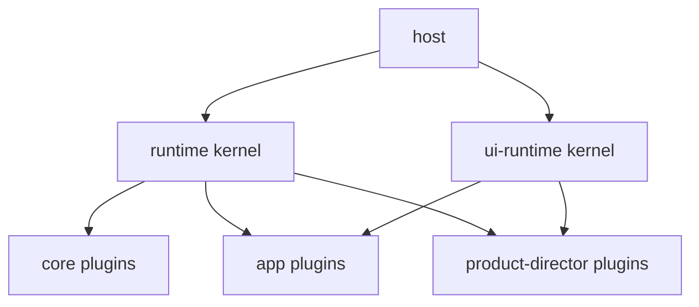

# Apps

An **app** is a composition of plugins that run on the two kernels.

```text
Host (local-cli or cloud)
  → createRuntime({ plugins: [core, app plugins, director, …] })
  → createUi({ plugins: [layout, app UI, director widget, …] })
```

The kernels do not know what the app is. Plugins do.

| Layer | What you pass |
| --- | --- |
| [Runtime](../runtime/) | Store, HTTP, tools, and domain plugins (mail, queue, …) |
| [UI runtime](../ui-runtime/) | Surfaces for `main` (the app) and `sidebar` (director) |

The same app runs **locally** or **in the cloud**. Swap the host and the store plugins. Each SQL [schema](../runtime/stores.md) is its own SQLite file, or its own Durable Object. Keep the rest.

## Model



- **Core**: stores, harnesses, sessions, HTTP. Same for every app.
- **App plugins**: the product (data, routes, and the `main` screen).
- **Director**: optional chrome. Sidebar widget only.

## Apps in this repo

| App | Package | Main screen |
| --- | --- | --- |
| [Marketplace](./marketplace.md) | `@buildautomaton/marketplace` | Catalog of plugins and apps (system) |
| [Email](./email.md) | `@buildautomaton/email` | Sample inbox. Listed on the marketplace, not in the host. |
