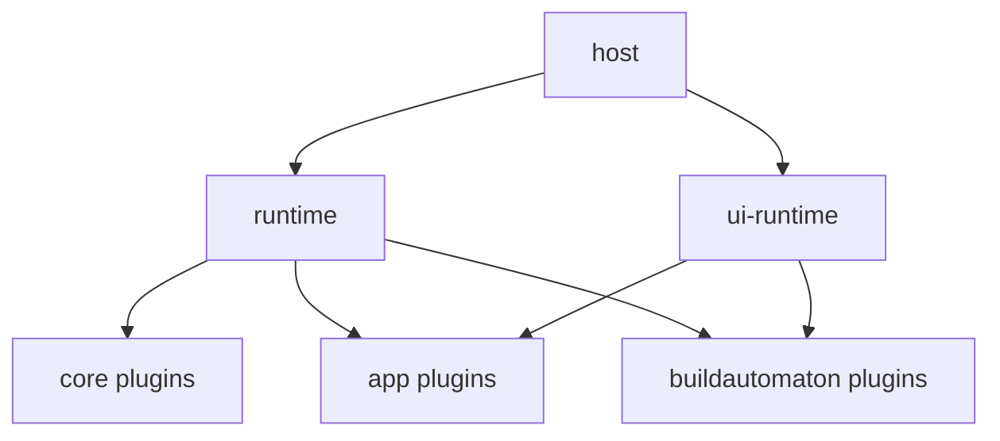

# Apps

An **app** is a composition of plugins that run on the two runtimes.

```text
Host (local-cli or cloud)
  → createRuntime({ plugins: [core, app plugins, buildautomaton, …] })
  → createUi({ plugins: [layout, app UI, buildautomaton widget, …] })
```

The runtimes do not know what the app is. Plugins do.

| Layer | What you pass |
| --- | --- |
| [Runtime](../runtime/) | Registries and lifecycle. It does not know the app. |
| [Plugins](../plugins/) | Store, HTTP, tools, and domain plugins (mail, queue, …) |
| [UI runtime](../ui-runtime/) | Surfaces for `main` (the app) and `sidebar` (buildautomaton) |

The same app runs **locally** or **in the cloud**. Swap the host and the store plugins. Each SQL [schema](../plugins/sqlite-store.md) is its own SQLite file, or its own Durable Object. Keep the rest.

## Model



- **Core**: stores, harnesses, sessions, HTTP. Same for every app.
- **App plugins**: the product (data, routes, and the `main` screen).
- **Buildautomaton**: the prompt screen and the sidebar widget.

## Apps

This repo ships the runtimes and plugins. Domain apps (inbox, catalog, and so on) live in the host that deploys them.
