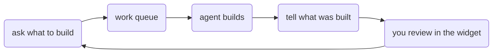

# Buildautomaton

Buildautomaton is the work queue and the app you start from a prompt. It lives in [`@buildautomaton/plugins`](../plugins/) as several plugins, and `coreSet()` installs them.

Someone writes what to build. An agent picks it up, does the work, and comes back with a summary. You review that in the **sidebar widget**, answer questions, and queue follow-ups.

It plugs into both runtimes:

- [Runtime plugins](./runtime.md) — queue, artifacts, tools, widget HTTP
- [UI plugins](./ui.md) — the prompt screen and the sidebar widget

[Local CLI](../local-cli/) (`app` mode) and [UI](../ui/) already compose those plugins.



The [local CLI](../local-cli/) opens a blank screen with a prompt. Submitting it morphs that screen into the app. The widget stays in the sidebar.

## Quick wire-up

```ts
import { createRuntime, coreSet, appPlugin } from '@buildautomaton/plugins';

const runtime = { cwd: process.cwd(), log: console.error };
await createRuntime({
  cwd: process.cwd(),
  plugins: [
    ...coreSet({ options: { cwd: process.cwd() }, runtime }),
    appPlugin({ runtime }),
  ],
});
```
