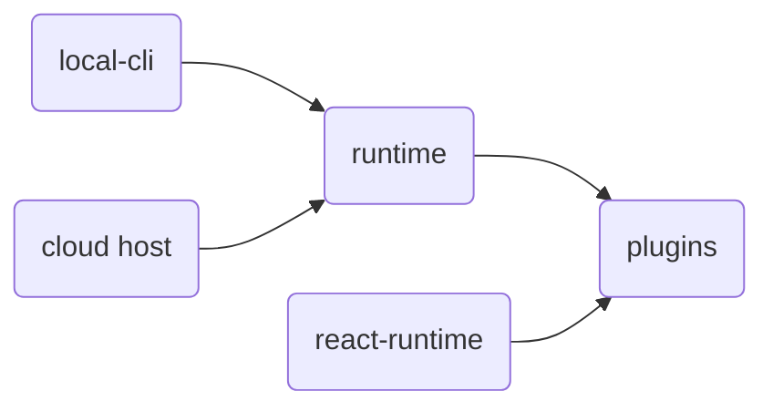

# Architecture

One open source app. It starts as a blank surface. You describe a problem, or the solution you want. Agents compose open source components into that software. The surface morphs into the interface. The runtime is the backend behind it.

Use the agents and models you want. Keep data on your own hardware, in your private cloud, or wherever you control it.

BuildAutomaton is how that app is built: two small runtimes plus plugins. You compose them into an **app**. Top-level folders are `runtimes/`, `plugins/`, `skills/`, `docs/`, and `apps/`.

| Runtime | Package | What it does |
| --- | --- | --- |
| [Node runtime](./runtime/) | `@buildautomaton/runtime` | Plugin and service registries, plus process start. |
| [Plugins](./plugins/) | `@buildautomaton/plugins` | Stores, sessions, harnesses, HTTP, and `coreSet`. |
| [React runtime](./react-runtime/) | `@buildautomaton/ui-runtime` | Wires UI plugins into a React app shell. |

The runtimes stay tiny and fast. Almost everything you see (agents, stores, tools, the work queue, the buildautomaton widget) is a plugin.

## Where the runtime runs

The same runtime runs **locally** or **in the cloud**. The host changes. The runtime and plugin contracts do not.

| Host | Package | Role |
| --- | --- | --- |
| Local | [Local CLI](./local-cli/) | `createRuntime` on your machine. Serves the app and tools. |
| Cloud | your cloud host | Same `createRuntime` call. Swap stores, HTTP, and auth plugins. |



## Plugins

A package can ship **runtime** plugins, **UI** plugins, or **both**. The runtime only indexes them. The plugin owns the behavior.

[Work plugins](./work/) power the BuildAutomaton prompt and sidebar: queue and tools on the node runtime, prompt and widget on the React runtime.

## What an app looks like

The main screen starts as the buildautomaton prompt. After you submit it, the running app fills the main panel and the widget stays in the sidebar.

```text
┌────────────────────────────────────────────┐
│  nav                                       │
├─────────────────────────────┬──────────────┤
│  main                       │  sidebar     │
│  the app                    │  BuildAutomaton │
│                             │  widget      │
└─────────────────────────────┴──────────────┘
```

[App host](./app-host/) is the ready-made shell. [Apps](./apps/) are plugin compositions you assemble in a host.

## Try it

```bash
npx @buildautomaton/local-cli app --cwd /path/to/repo
```

That is **dev** (Vite HMR). On a server: `local-cli app --prod`. From this repo: `pnpm install && pnpm dev`. Public packages publish under `@buildautomaton`.
