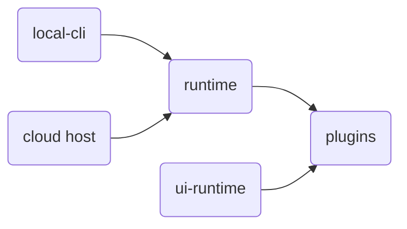

# Architecture

meta-harness is two small runtimes plus plugins. You compose them into an **app**.

| Runtime | Package | What it does |
| --- | --- | --- |
| [Runtime](./runtime/) | `@buildautomaton/runtime` | Plugin and service registries, plus lifecycle. |
| Plugins | `@buildautomaton/plugins` | Stores, sessions, harnesses, HTTP, and `createRuntime`. |
| [UI runtime](./ui-runtime/) | `@buildautomaton/ui-runtime` | Wires UI plugins into an app shell. |

The runtimes stay tiny and fast. Almost everything you see (agents, stores, tools, the work queue, the director widget) is a plugin.

## Where the runtime runs

The same runtime runs **locally** or **in the cloud**. The host changes; the runtime and plugin contracts do not.

| Host | Package | Role |
| --- | --- | --- |
| Local | [Local CLI](./local-cli/) | `createRuntime` on your machine. Serves the app and tools. |
| Cloud | your cloud host | Same `createRuntime` call. Swap stores, HTTP, and auth plugins. |



## Plugins

A package can ship **runtime** plugins, **UI** plugins, or **both**. The runtime only indexes them. The plugin owns the behavior.

[Product director](./product-director/) is the dual example: queue and tools on the runtime, a sidebar widget on the UI runtime.

## What an app looks like

The main screen is always the **app**. Product director is not a dashboard of its own. It is a **sidebar widget** on that app.

```text
┌────────────────────────────────────────────┐
│  nav                                       │
├─────────────────────────────┬──────────────┤
│  main                       │  sidebar     │
│  the app                    │  director    │
│                             │  widget      │
└─────────────────────────────┴──────────────┘
```

[UI](./ui/) is the ready-made host for that shell. [Apps](./apps/) are plugin compositions. [Email](./apps/email.md) is a sample domain app. [Marketplace](./apps/marketplace.md) is the catalog.

## Try it

```bash
npx @buildautomaton/local-cli app --cwd /path/to/repo
```

That is **dev** (Vite HMR). On a server: `local-cli app --prod`. From this repo: `pnpm install && pnpm dev`. Public packages publish under `@buildautomaton`.
