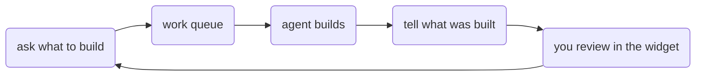

# Product director

Product director is how agents and humans share a **work queue**. It is a **plugin pack**, not an app and not a main screen.

Someone writes down what to build next. An agent picks it up, does the work, and comes back with a clear summary. You review that in the **sidebar widget** on the [app](../ui/), answer questions, and queue follow-ups.

It plugs into both kernels:

- [Runtime plugins](./runtime.md) — queue, artifacts, director tools, widget HTTP
- [UI plugin](./ui.md) — the sidebar widget only

[Local CLI](../local-cli/) (`app` mode) and [UI](../ui/) already compose those plugins.



The main screen stays the app. Director has no product tabs and no full-page board.

## Quick wire-up

```ts
import { createRuntime, coreSet, appPlugin } from '@buildautomaton/runtime';
import { productDirectorSet, directorHttpEndpoints } from '@buildautomaton/product-director';

const runtime = { cwd: process.cwd(), log: console.error };
await createRuntime({
  cwd: process.cwd(),
  plugins: [
    ...coreSet({ options: { cwd: process.cwd(), httpEndpoints: directorHttpEndpoints() }, runtime }),
    ...productDirectorSet({ runtime }),
    appPlugin({ runtime }),
  ],
});
```
